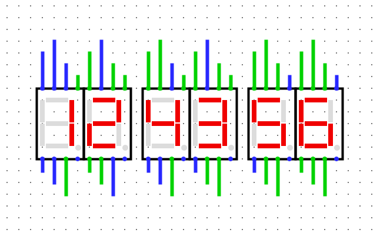

# 74clock

The goal of 74clock is to build a simple wall clock using an crystal oscillator, 74 logic circuits and simple 7-segment displays.

This repo will hold [Logisim Evolution](https://github.com/logisim-evolution/logisim-evolution/) circuit files, circuit board layouts and bill of materials.

